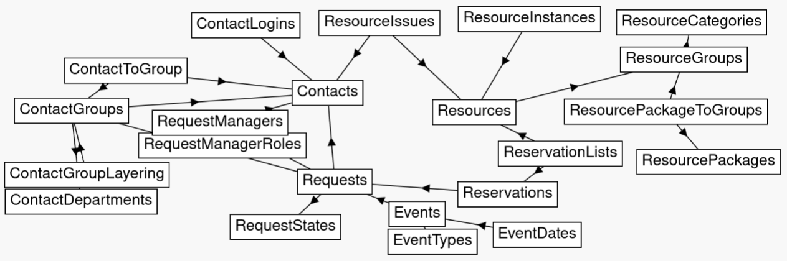

Verein
======
__Verein__ intends to provide a simple digital infrastructure for cultural communities.


Setup steps
===========
1. Clone repository

  ```
  git clone https://github.com/p3732/verein.git
  ```

2. Install required npm packages

  ```
  cd verein
  npm install .
  ```

3. Setup configuration

  ```
  cp -R config_example config
  ```

    These can be changed to fit your intended usage. The config files should
    have enough comments to make them self-explanatory. (In case they are not,
    please open an issue.)

4. Start the server

  ```
  node init
  ```

Developer
=========
Link config folder
------------------
A symlink is handy to avoid copying changed default values for- and backward
between the `config` and the `config_example` folder:

  ```
  ln -s config_example config
  ```


Run `standard` linter
---------------------
Let the [standard linter](https://github.com/standard/standard) fix your
indention mistakes and other minor flaws before you commit. Install it with `npm i standard` and then run:

  ```
  npx standard --fix
  ```

Explore database schema
-----------------------
A nice way to look explore the database schema, is to use [SQL Schema Explorer](https://github.com/timabell/schema-explorer).
Here is a reference picture:

